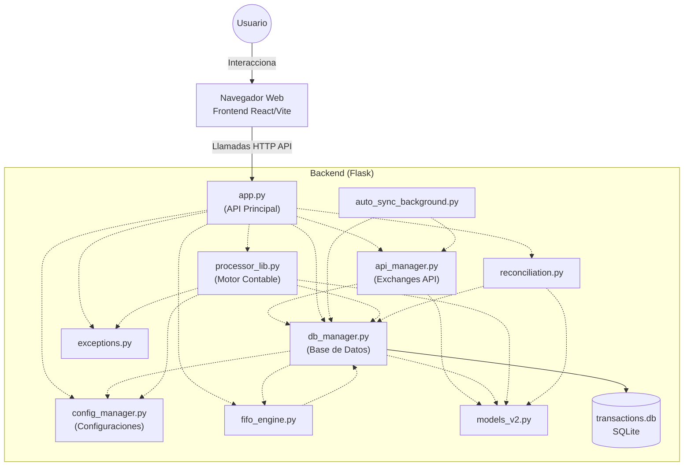

# CryptoTax Pro - Sistema Contable de Criptomonedas

Este proyecto es un motor y sistema contable para el procesamiento de transacciones financieras de criptomonedas provenientes de diferentes exchanges (Binance, Bitso, Fiwind, Ripio, etc.), con cálculo de impuestos (Ganancias e IIBB) para Argentina.

---

## 🚀 Cómo Iniciar la Aplicación

Tienes dos formas de iniciar el sistema desde la raíz del proyecto:

1. **Modo Silencioso (Recomendado para uso diario):**
   * Haz doble clic en el archivo [launch_silent.vbs](file:///c:/Users/juanc/Desktop/Carpetas%20varias/Motor%20Programa%20Contable/launch_silent.vbs).
   * Iniciará el Backend y el Frontend en segundo plano (sin abrir ventanas negras de consola) y abrirá automáticamente la interfaz visual en tu navegador predeterminado en modo aplicación.
   * **Para cerrarlo:** Haz doble clic en [stop_app.bat](file:///c:/Users/juanc/Desktop/Carpetas%20varias/Motor%20Programa%20Contable/stop_app.bat).

2. **Modo Consola (Recomendado para desarrollo/depuración):**
   * Haz doble clic en [run_app.bat](file:///c:/Users/juanc/Desktop/Carpetas%20varias/Motor%20Programa%20Contable/run_app.bat).
   * Iniciará el Backend y el Frontend mostrando las consolas para ver logs y posibles errores en tiempo real.

---

## 📁 Estructura del Proyecto

* **[webapp/](file:///c:/Users/juanc/Desktop/Carpetas%20varias/Motor%20Programa%20Contable/webapp):** Contiene el código fuente productivo de la aplicación:
  * `backend/`: API construida en Python (Flask), encargada de la lógica contable, base de datos (`transactions.db`) y procesamiento.
  * `frontend/`: Interfaz visual web construida en React + Vite + TypeScript.
* **[scripts/](file:///c:/Users/juanc/Desktop/Carpetas%20varias/Motor%20Programa%20Contable/scripts):** Carpeta de utilidades, herramientas de depuración y respaldos históricos.
* **Archivos Raíz:** Únicamente archivos de configuración (`mappings.json`), lanzadores (`.vbs`, `.bat`, `start_system.py`, `stop_system.py`) y recursos visuales (`app.ico`).

---

## 🧹 Directrices para Código de Prueba y Depuración

Para mantener la raíz del proyecto **limpia y ordenada**, se establece la siguiente regla obligatoria:

> [!IMPORTANT]
> **Todo código temporal, de prueba, utilidades o depuración** que no forme parte directa del código productivo de la aplicación (el cual debe vivir dentro de `webapp/`) **DEBE ser guardado obligatoriamente dentro de la carpeta `scripts/`**.
>
> Ejemplos de lo que debe ir en `scripts/`:
> * Scripts para probar APIs de exchanges de manera aislada.
> * Programas para revisar columnas de archivos CSV (`debug_columns.py`, etc.).
> * Pruebas locales de procesadores de texto.
> * Copias de seguridad o volcados de bases de datos temporales.

---

## 🏗️ Arquitectura y Flujo del Sistema

El sistema está diseñado bajo una arquitectura cliente-servidor clásica (Frontend-Backend). Esta sección se genera **dinámicamente** analizando la estructura de archivos y las dependencias de importación reales del código fuente.

### 📊 Diagrama de Dependencias y Flujo de Control

> [!NOTE]
> Las líneas punteadas `-.->` indican dependencias directas de importación (`import`) detectadas estáticamente en el código backend.

### 📁 Estructura Detectada del Proyecto

#### Aplicación Web (`webapp/`)
- `webapp/frontend/`: React application (Vite + TypeScript)
- `webapp/backend/`: Python API (Flask)

#### Módulos de Backend Detectados (`webapp/backend/`)
- `api_manager.py` - Conectores con las APIs de Exchanges (Binance, Bitso, Bybit, etc.).
- `app.py` - Servidor Flask principal y definición de endpoints API.
- `auto_sync_background.py`
- `config_manager.py` - Manejo de archivos de configuración (.json) y variables .env.
- `db_manager.py` - Gestión de base de datos SQLite y cálculos de KPIs / Impuestos.
- `exceptions.py`
- `fifo_engine.py`
- `models_v2.py`
- `processor_lib.py` - Motor contable que unifica formatos de CSVs/Excel/APIs e impide duplicados.
- `reconciliation.py` - Motor de conciliación contable y clasificación de anomalías.
