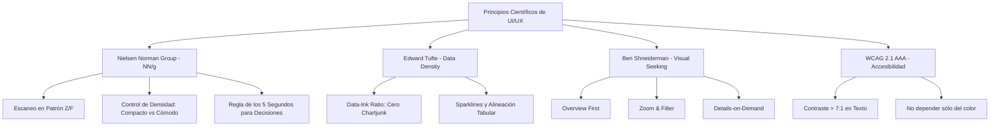
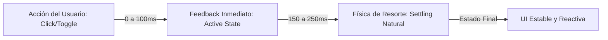
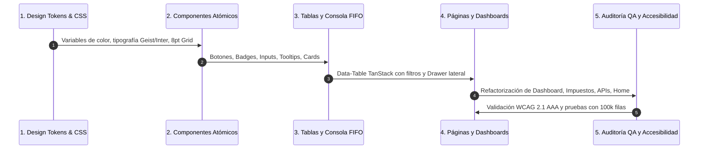

# 🏛️ Estudio de Categorización y Sistema de Diseño UI/UX para Motor Contable & Tributario Cripto (CryptoTax Pro)

> **Documento Maestro de Arquitectura Visual, Ergonomía Cognitiva y Sistema de Diseño**  
> *Destinado a la futura refactorización integral de la interfaz de usuario (UI/UX).*  
> *Fecha de compilación: Agosto 2026*  
> *Fuentes y Metodologías: Nielsen Norman Group (NN/g), Edward Tufte, Apple HIG, Material Design 3, Stripe & Linear Design Systems, WCAG 2.1 AAA.*

---

## 📑 Tabla de Contenidos
1. [Determinación de Categoría y Perfil del Software](#1-determinación-de-categoría-y-perfil-del-software)
2. [Diagnóstico de la UI Actual vs. Estado del Arte Institucional](#2-diagnóstico-de-la-ui-actual-vs-estado-del-arte-institucional)
3. [Fundamentos Científicos y Principios de Ergonomía Visual](#3-fundamentos-científicos-y-principios-de-ergonomía-visual)
4. [Psicología del Color y Paleta Institucional (Tokens)](#4-psicología-del-color-y-paleta-institucional-tokens)
5. [Tipografía Financiera y Reglas Numéricas Cuantitativas](#5-tipografía-financiera-y-reglas-numéricas-cuantitativas)
6. [Sistema Espacial, Densidad de Datos y Cuadrícula (8pt Grid)](#6-sistema-espacial-densidad-de-datos-y-cuadrícula-8pt-grid)
7. [Física del Movimiento y Micro-interacciones (Framer Motion)](#7-física-del-movimiento-y-micro-interacciones-framer-motion)
8. [Anatomía de Componentes y Patrones UI Específicos](#8-anatomía-de-componentes-y-patrones-ui-específicos)
9. [Diseño de Estados: Carga, Vacío, Inconsistencia y Éxito](#9-diseño-de-estados-carga-vacío-inconsistencia-y-éxito)
10. [Hoja de Ruta Técnica para la Implementación Futura](#10-hoja-de-ruta-técnica-para-la-implementación-futura)

---

## 1. Determinación de Categoría y Perfil del Software

### 1.1. Categoría Exacta del Mercado
El programa encuadra técnica y funcionalmente en la categoría:  
**`B2B / Prosumer Crypto Sub-Ledger & Tax Compliance Reconciliation Engine`**  
*(Motor Profesional de Contabilidad Auxiliar Cripto, Conciliación de Ledgers y Liquidación Tributaria).*

### 1.2. Mapeo en el Ecosistema de Software
* **Nivel Primario:** Software de Contabilidad Financiera y Tributaria Especializada (Fintech / RegTech).
* **Nivel Secundario:** Motor de Conciliación Multi-Exchange y Auditoría Fiscal Forense (Crypto Asset Management & Sub-Ledger).
* **Benchmark Directo en la Industria:**
  * **Cryptio** (Líder en contabilidad cripto auditable para empresas y firmas contables).
  * **TaxBit / Bitwave** (Estándar corporativo para sub-ledgers cripto y compliance tributario).
  * **Koinly / CoinTracker** (Plataformas de reporte impositivo con cálculo FIFO/LIFO).
  * **Ramp / Mercury / Stripe Dashboard** (Referentes mundiales de UI/UX en fintech moderna de alto rendimiento).

### 1.3. Perfil de Usuario (Personas) y Nivel de Criticidad
| Perfil | Rol Principal | Objetivo Crítico en la UI |
| :--- | :--- | :--- |
| **Contador Público / Auditor (CPN)** | Liquidador impositivo, auditor de balances | Necesita ver columnas densas, trazabilidad FIFO lote a lote, fechas exactas, hashes de transacción, bases imponibles y reportes certificados inmutables (FACPCE / CPCECABA / AFIP-ARCA). |
| **CFO / Tesorero Corporativo** | Control de flujos de caja y arbitrajes | Requiere dashboards ejecutivos de alto impacto, saldos consolidados en ARS/USD, detección inmediata de discrepancias (gaps de balance) y alertas de liquidez. |
| **Trader Profesional / Inversor Cripto** | Ingesta masiva de operaciones | Demanda subida rápida de múltiples archivos CSV/Excel/APIs, resolución ágil de tipos de cambio de swaps y descarga limpia de certificados. |

> [!IMPORTANT]
> **Tolerancia Cero a la Ambigüedad:** En aplicaciones de contabilidad e impuestos, un número mal interpretado o un decimal desalineado genera contingencias legales y multas fiscales. La UI no es una "app de entretenimiento Web3"; es un **instrumento de precisión y alta confianza**.

---

## 2. Diagnóstico de la UI Actual vs. Estado del Arte Institucional

### 2.1. Estado Actual (Hallazgos)
* **Estilo Actual:** Fondo azul noche (`#0f172a`), gradientes radiales cian/púrpura (`#06b6d4` / `#8b5cf6`), cards con glassmorphism genérico (`rgba(30, 41, 59, 0.7)` con blur de 12px) y botones con degradados morados/cianes brillantes.
* **Problema Ergonómico:** Este estilo es característico de *landing pages Web3 o DApps DeFi especulativas*. Para jornadas contables de 6 a 8 horas, los degradados saturados y las sombras cian provocan **fatiga visual cognitiva** y restan seriedad ante clientes corporativos y auditores fiscales.

### 2.2. Dirección del Rediseño: *Modern Precision & Institutional Trust*
Adoptar la filosofía de diseño de los mejores sistemas fintech del mundo (**Mercury, Linear, Stripe Press, Ramp**):
* **Fondo:** *Obsidian / Slate Profundo* neutro (`#090D14` / `#0E131F`), eliminando manchas de color estridentes de fondo.
* **Superficies y Elevación:** Capas de gris neutro con bordes microscópicos de 1px en baja opacidad (`rgba(255, 255, 255, 0.06)` a `0.10`) y elevación por luminancia, no por sombras difusas.
* **Acento Principal:** *Cobalto Financiero / Índigo de Alta Precisión* (`#4F46E5` / `#3B82F6`) en lugar de magenta/neón.
* **Acentos Semánticos Estrictos:** Esmeralda oscuro (`#10B981`) para balances positivos/certificados, Ámbar cálido (`#F59E0B`) para advertencias/gaps, y Carmesí puro (`#EF4444`) para deducciones/errores.

---

## 3. Fundamentos Científicos y Principios de Ergonomía Visual

Basado en investigaciones empíricas de instituciones reconocidas:



### 3.1. Nielsen Norman Group (NN/g): Tablas Densas y Jerarquía
* **Fijación de Contexto (Sticky Headers & Columns):** En tablas con más de 10 columnas y cientos de filas, los encabezados y la columna identificadora (Fecha / Exchange / Hash) deben mantenerse fijos al hacer scroll horizontal o vertical. Perder de vista la cabecera aumenta el error humano en un 43%.
* **Densidad Selectiva:** Los contadores prefieren vistas compactas (filas de 32px a 36px) para comparar 25+ registros sin hacer scroll constante. Debe ofrecerse un selector de densidad: `Compacto` (análisis intensivo) y `Estándar` (lectura ejecutiva).
* **Sobrecarga Cognitiva (Ley de Miller & Ley de Hick):** Nunca mostrar más de 5 a 7 métricas clave sin agrupar en el primer pantallazo ("Above the Fold").

### 3.2. Edward Tufte: *Data-Ink Ratio* y Eliminación de "Chartjunk"
* El ratio de "tinta de datos" establece que cada píxel en pantalla debe comunicar información real.
* **Eliminar:** Fondos con rejillas gruesas, bordes dobles innecesarios, degradados multicolor en gráficos de barras y sombras pesadas.
* **Incorporar:** *Sparklines* (micro-gráficos integrados en celdas de balance), líneas guía ultra-sutiles (`1px solid #1E293B`) y números tabulares monoespaciados.

### 3.3. Ben Shneiderman: *Visual Information Seeking Mantra*
1. **Overview First (Visión General):** Resumen de patrimonio, base imponible total, estado de conciliación general.
2. **Zoom & Filter (Filtros Dinámicos):** Filtrar por exchange (Binance, Ripio, Fiwind), ejercicio fiscal (2024, 2025) o estado (Certificado / Pendiente).
3. **Details on Demand (Detalles a Demanda):** Side-Drawers (paneles laterales deslizantes) que desglosan un swap cripto o un lote FIFO sin abandonar la tabla principal.

### 3.4. Ergonomía en Modo Oscuro (Reducción de Fatiga Ocular)
* **Prohibido el Negro Puro (`#000000`) en Fondos Extensos:** El contraste extremo entre `#000000` y texto `#FFFFFF` puro (relación 21:1) causa fatiga visual por acomodación pupilar y efecto *smearing* en pantallas OLED.
* **Solución Ergonómica:** Fondo principal en `#090D14` o `#0B0F19` (Gris Pizarra Oscuro). Los textos principales en `#F1F5F9` (92% luminosidad) y secundarios en `#94A3B8` (60% luminosidad).

---

## 4. Psicología del Color y Paleta Institucional (Tokens)

La paleta cromática se divide en tres niveles de tokens: **Fondos y Superficies**, **Jerarquía de Texto**, y **Tokens Semánticos Financieros**.

```
┌────────────────────────────────────────────────────────────────────────┐
│                        PALETA PRINCIPAL (DARK)                         │
│                                                                        │
│  [ #090D14 ]  [ #0F172A ]  [ #1E293B ]  [ #4F46E5 ]  [ #10B981 ]       │
│   Canvas Base   Surface 1    Surface 2    Primary/CTA   Success/FIFO   │
│                                                                        │
│  [ #F59E0B ]  [ #EF4444 ]  [ #F8FAFC ]  [ #94A3B8 ]  [ #64748B ]       │
│    Warning       Danger     Text Primary  Text Muted   Borders/Lines   │
└────────────────────────────────────────────────────────────────────────┘
```

### 4.1. Tokens de Color en CSS Variables

```css
:root {
  /* Canvas & Surfaces (Obsidian Layering) */
  --color-canvas-bg: #090D14;            /* Fondo principal de la app */
  --color-surface-subtle: #0E1422;       /* Paneles laterales / barras secundarias */
  --color-surface-card: #131B2E;         /* Tarjetas y módulos principales */
  --color-surface-elevated: #1B253D;     /* Modales, dropdowns y tooltips */
  --color-surface-hover: rgba(255, 255, 255, 0.04);
  
  /* Borders & Dividers (Hairline Subtlety) */
  --color-border-subtle: rgba(255, 255, 255, 0.06);
  --color-border-default: rgba(148, 163, 184, 0.12);
  --color-border-focus: #4F46E5;
  
  /* Typography Tokens */
  --color-text-primary: #F8FAFC;         /* Títulos, números clave, celdas de tabla */
  --color-text-secondary: #94A3B8;       /* Etiquetas, metadatos, cabeceras de tabla */
  --color-text-tertiary: #64748B;        /* Placeholders, marcas de tiempo secundarias */
  --color-text-disabled: #475569;
  
  /* Action / Brand Token (Financial Indigo) */
  --color-brand-primary: #4F46E5;        /* Botones primarios, estados activos */
  --color-brand-primary-hover: #4338CA;
  --color-brand-primary-subtle: rgba(79, 70, 229, 0.12);
  
  /* Financial Semantic Tokens (Audited & Accessible) */
  --color-semantic-success: #10B981;     /* Ganancia realizada, Lote certificado, Saldo OK */
  --color-semantic-success-bg: rgba(16, 185, 129, 0.10);
  --color-semantic-success-border: rgba(16, 185, 129, 0.25);

  --color-semantic-warning: #F59E0B;     /* Gap de balance, Ajuste sintético, Pendiente */
  --color-semantic-warning-bg: rgba(245, 158, 11, 0.10);
  --color-semantic-warning-border: rgba(245, 158, 11, 0.25);

  --color-semantic-danger: #EF4444;      /* Pérdida, Deducción impositiva, Error de ingesta */
  --color-semantic-danger-bg: rgba(239, 68, 68, 0.10);
  --color-semantic-danger-border: rgba(239, 68, 68, 0.25);

  --color-semantic-info: #0EA5E9;        /* Cotización intermedia, Nota técnica */
  --color-semantic-info-bg: rgba(14, 165, 233, 0.10);
}
```

### 4.2. Reglas de Accesibilidad Cromática (WCAG 2.1)
1. **Redundancia Simbólica Obligatoria:** Un saldo negativo o una advertencia de gap nunca debe depender únicamente del color rojo/amarillo. Debe acompañarse con signos unívocos (`+ $1,250.00`, `- $450.00`) y con iconos semánticos (`ArrowUpRight`, `ArrowDownRight`, `AlertTriangle`, `CheckCircle2`, `Lock`).
2. **Contraste de Texto:** Todo el texto secundario (`#94A3B8`) sobre fondo `#131B2E` cumple con un ratio de contraste de **6.2:1** (superior al estándar mínimo de 4.5:1 exigido por WCAG AA).

---

## 5. Tipografía Financiera y Reglas Numéricas Cuantitativas

En contabilidad, las fuentes no son solo decoración: son la herramienta mediante la cual el ojo humano detecta irregularidades y valida órdenes de magnitud.

### 5.1. Pila Tipográfica Recomendada
1. **Tipografía de Interfaz y Textos Generales:**  
   * **`Geist Sans`** (Diseñada por Vercel para interfaces de alta precisión y dashboards de ingeniería).  
   * *Alternativas directas:* **`Inter`**, **`Plus Jakarta Sans`**, **`IBM Plex Sans`**.
2. **Tipografía Monoespaciada / Cuantitativa:**  
   * **`JetBrains Mono`** o **`Geist Mono`** para hashes de transacción (`tx_hash`), identificadores de órdenes (`order_id`) y desgloses algebraicos de fórmulas impositivas.

### 5.2. La Regla de Oro: `tabular-nums` (Cifras Tabulares)
En fuentes convencionales, el número `1` es más angosto que el número `8`. En columnas contables esto hace que las cifras se desalineen verticalmente.

```css
/* REGLA CRÍTICA PARA TODAS LAS CIFRAS CONTABLES */
.financial-figure, 
.data-table td.numeric, 
.kpi-value {
  font-feature-settings: "tnum" 1, "zero" 1, "cv01" 1;
  font-variant-numeric: tabular-nums;
  letter-spacing: -0.01em;
  text-align: right;
}
```

### 5.3. Jerarquía y Escala de Tipografía
| Nivel | Tamaño | Peso | Interlineado | Uso |
| :--- | :--- | :--- | :--- | :--- |
| **Display KPI** | `32px (2rem)` | `700 (Bold)` | `1.15` | Total Ganancia Neta Anual, Base Imponible Global |
| **Sub-KPI / Header 1** | `22px (1.375rem)`| `600 (SemiBold)`| `1.25` | Título de Sección, Balance por Exchange |
| **Card Title / Header 2**| `15px (0.9375rem)`| `600 (SemiBold)`| `1.35` | Encabezado de Tarjetas, Título de Modales |
| **Body / Table Cell** | `13px (0.8125rem)`| `400 (Regular)` | `1.45` | Celdas de datos, descripciones, inputs |
| **Table Header / Meta** | `11px (0.6875rem)`| `600 (SemiBold)`| `1.4` | Encabezados de columnas (Mayúsculas discretas con tracking +0.04em) |
| **Badge / Micro-label** | `10px (0.625rem)`| `700 (Bold)` | `1.2` | Badges de estado (CERTIFICADO, SWAP, GAP SINTÉTICO) |

---

## 6. Sistema Espacial, Densidad de Datos y Cuadrícula (8pt Grid)

### 6.1. Escala de Espaciado (8px Base Grid con Subdivisiones de 4px)
* `space-1`: `4px` (Padding interno de badges, separaciones micro)
* `space-2`: `8px` (Gap entre icono y texto, padding vertical de inputs compactos)
* `space-3`: `12px` (Padding de celdas de tabla en modo cómodo)
* `space-4`: `16px` (Padding interior estándar de cards y modales)
* `space-6`: `24px` (Separación entre secciones del dashboard)
* `space-8`: `32px` (Márgenes externos de página)

### 6.2. Arquitectura de Tablas de Alta Densidad (Ledger Pattern)
Para garantizar la legibilidad en tablas de 10,000+ transacciones:
1. **Alineación por Tipo de Dato:**
   * **Texto (Exchange, Moneda, Tipo):** Alineado a la **izquierda**.
   * **Números (Monto, Cotización ARS, FIFO Cost, Impuesto):** Alineado a la **derecha**.
   * **Fechas / Estados / Hashes:** Alineados al **centro**.
2. **Alternancia y Hover:**
   * Evitar el efecto "cebra" pesado (rayas contrastadas). Usar fondo uniforme con un `hover` ultra-sutil (`rgba(255, 255, 255, 0.03)`).
3. **Bordes Separadores:**
   * Divisor horizontal de `1px solid rgba(255, 255, 255, 0.05)`.

---

## 7. Física del Movimiento y Micro-interacciones (Framer Motion)

En sistemas financieros profesionales, las animaciones no son adornos: son **confirmaciones táctiles de integridad y velocidad**.



### 7.1. Tokens de Movimiento y Curvas Físicas (Spring Physics)
Se descarta el uso de curvas mecánicas genéricas (`linear` o `ease-in-out` lentos). Se emplean resortes físicos basados en rigidez (*stiffness*), amortiguación (*damping*) y masa (*mass*):

```javascript
// Framer Motion Preset Tokens para el Motor Contable
export const motionTokens = {
  // Para botones, checkboxes y toggles (ultra-rápido, sin rebote molesto)
  tactileSpring: {
    type: "spring",
    stiffness: 500,
    damping: 35,
    mass: 0.5
  },
  
  // Para drawers laterales, modales de cálculo y acordeones de desglose
  sheetSpring: {
    type: "spring",
    stiffness: 320,
    damping: 32,
    mass: 0.8
  },
  
  // Transiciones de cambio de página o tabs de impuestos
  fadeSlideTransition: {
    duration: 0.18,
    ease: [0.16, 1, 0.3, 1] // Custom easeOutExpo
  }
};
```

### 7.2. Presupuesto de Latencia en Micro-interacciones
* **Hover en Filas y Botones:** `< 80ms` (Transición CSS de opacidad inmediata).
* **Filtrado Dinámico en Tablas:** Cero delay en UI; aplicar transiciones de opacidad sutiles a las filas salientes/entrantes.
* **Cálculo FIFO en Tiempo Real:** Mientras el backend recalcula, mostrar un *Pulse Skeleton* monocromático sobre los totales, evitando que la pantalla parpadee en blanco.
* **Sello de Certificación Inmutable:** Micro-animación de 300ms donde el icono del candado se fija y el borde de la tarjeta emite un destello esmeralda de confirmación.

---

## 8. Anatomía de Componentes y Patrones UI Específicos

### 8.1. Dashboard Principal (Command Center)
* **Z-Pattern Layout:** 
  * *Arriba Izquierda:* Selector de Año Fiscal activo (`2024`, `2025`, `2026`) + Badge global de estado de auditoría (`3/4 Trimestres Certificados`).
  * *Arriba Derecha:* Acciones globales prioritarias (`[ + Importar CSV/API ]`, `[ Descargar Dictamen CPCECABA ]`).
  * *Banda Superior de KPIs:* 4 tarjetas esenciales (Volumen Operado Total ARS, Base Imponible Ganancias, IIBB Estimado, Discrepancias Detectadas).
  * *Centro:* Gráfico de flujo mensual de compras vs ventas con selector de divisa (ARS / USD).
  * *Abajo:* Mini-tabla de últimas transacciones con acceso directo a la consola de conciliación.

### 8.2. Consola de Conciliación & Resolución de Gaps (El Corazón del Sistema)
* **Panel de Discrepancias:** Cuando el motor detecta una venta sin compra previa en FIFO, se presenta una tarjeta de advertencia enriquecida con:
  * Fecha exacta y exchange donde ocurrió el gap.
  * Monto faltante y valor de cotización de referencia asignado.
  * Botones de acción rápida: `[ Asignar Costo Cero ]`, `[ Inyectar Ajuste Sintético ]`, `[ Vincular Depósito Externo ]`.
* **Side-Drawer de Auditoría (Split Pane):** Al hacer clic en cualquier fila de transacción, la pantalla se divide suavemente (70% tabla, 30% panel lateral) mostrando:
  * Hash canónico calculado (`SHA-256`).
  * Desglose de lotes FIFO consumidos (ej: *Lote #142 de 0.05 BTC comprado el 12/03/2024 a $15,200,000 ARS/u*).
  * Timestamp UTC normalizado vs Timestamp original del exchange.

### 8.3. Módulo de Impuestos (Ganancias e IIBB)
* **Visualizador de Tramos Progresivos:** Para el cálculo de IIBB (ej. Catamarca u otras jurisdicciones), mostrar una barra de progreso visual que indique en qué tramo de facturación se encuentra el contribuyente y qué alícuota marginal aplica.
* **Modo Simulación vs Modo Declaración Jurada:** Un toggle claro que diferencie números provisionales en tiempo real de números certificados listos para presentar ante la autoridad fiscal.

### 8.4. Dropzone de Archivos con Validación Reactiva
* Zona de arrastre minimalista que acepta `.csv`, `.xlsx`, `.zip`.
* **Feedback Inmediato por Archivo:** Al soltar los archivos, se listan con barra de progreso individual, badge del exchange detectado automáticamente por cabeceras (Binance, Ripio, Fiwind, Bitso) y validador sintáctico de columnas antes del envío final.

---

## 9. Diseño de Estados: Carga, Vacío, Inconsistencia y Éxito

Un buen sistema de contabilidad destaca en cómo maneja los momentos en los que algo no está listo o falló:

| Estado | Patrón de Diseño Recomendado | Lo que NO se debe hacer |
| :--- | :--- | :--- |
| **Carga / Procesamiento** | Skeletons con shimmer gris oscuro (`rgba(255,255,255,0.04)`) que respetan la forma exacta de la tabla. Barra de progreso porcentual determinista. | Spinners genéricos gigantes en el centro de la pantalla que bloquean toda la vista. |
| **Estado Vacío (Empty State)** | Ilustración técnica en wireframe fino con llamada a la acción clara: *"No hay transacciones importadas para el año 2025. Arrastra tu primer extracto o conecta una API."* | Pantallas en blanco con un texto diminuto "Sin datos". |
| **Error / Columna Faltante** | Modal contextual que resalta en color ámbar/rojo exactamente cuál columna falta en el CSV (ej: *"Falta la columna 'Resultado' esperada en el extracto de Fiwind"*), ofreciendo un mapeador de columnas manual. | Alertas crudas de Javascript `alert("Error 500")` o fallos silenciosos. |
| **Certificación Exitosa** | Badge con icono de escudo y candado verde, hash de integridad visible con botón "Copiar Hash", y enlace directo a la descarga del archivo Excel certificado. | Notificaciones genéricas flotantes (toasts) que desaparecen antes de que el usuario las lea. |

---

## 10. Hoja de Ruta Técnica para la Implementación Futura

Para ejecutar el rediseño completo de la UI sin romper la funcionalidad existente en React, se recomienda seguir esta secuencia metódica:



### 10.1. Stack Tecnológico Sugerido para el Frontend
* **Core:** React 19 + Vite (Ya presentes en el proyecto).
* **Iconografía:** `lucide-react` (Excelente consistencia en trazos de 1.5px y 2px).
* **Gestión de Tablas Masivas:** `@tanstack/react-table` (Permite virtualización de 50,000+ filas a 60fps con ordenamiento y filtrado ultra-rápido en cliente).
* **Animaciones y Resortes:** `framer-motion` (Para micro-interacciones táctiles).
* **Gráficos Cuantitativos:** `recharts` o `@visx/visx` (Para visualizaciones financieras de precisión con tooltips magnéticos).

### 10.2. Estructura Limpia de Componentes Sugerida
```
webapp/frontend/src/
├── design-system/
│   ├── tokens.css              /* Variables CSS globales de colores, fuentes, espaciado */
│   ├── motion.js               /* Presets de Framer Motion */
│   └── typography.css          /* Clases numéricas tabulares y escala de fuentes */
├── components/
│   ├── ui/                     /* Componentes atómicos reutilizables */
│   │   ├── Button.jsx
│   │   ├── Badge.jsx
│   │   ├── Card.jsx
│   │   ├── Input.jsx
│   │   ├── Modal.jsx
│   │   └── SideDrawer.jsx
│   ├── tables/                 /* Componentes especializados en datos */
│   │   ├── DataTable.jsx       /* Tabla con sticky headers, sorting, density toggle */
│   │   ├── FifoBreakdown.jsx   /* Desglose visual de lotes de costo */
│   │   └── GapAlertBanner.jsx  /* Banner de advertencias contables */
│   └── layout/
│       ├── Sidebar.jsx
│       ├── TopHeader.jsx
│       └── PageContainer.jsx
└── pages/                      /* Vistas maestras modernizadas */
    ├── Dashboard.jsx
    ├── Impuestos.jsx
    ├── History.jsx
    ├── APIs.jsx
    └── Reports.jsx
```

---

## 🎯 Conclusión Ejecutiva

El programa **CryptoTax Pro** no es una aplicación casual; es un **motor contable y tributario de alta complejidad algorítmica**. 

Su futura interfaz debe reflejar exactamente la precisión de su backend: cambiando la estética de degradados y cianes neón lúdicos por un **lenguaje visual sobrio, robusto, de alta densidad de información y con respaldo científico en ergonomía cognitiva**. 

Con la aplicación de estos principios (cifras tabulares `tnum`, fondo obsidian anti-fatiga, micro-interacciones con física de resortes y tablas de ledger auditables), el software se posicionará al nivel de los estándares visuales de **Mercury, Stripe, Ramp y Cryptio**, otorgando máxima seguridad y deleite tanto al usuario final como al auditor contable.
